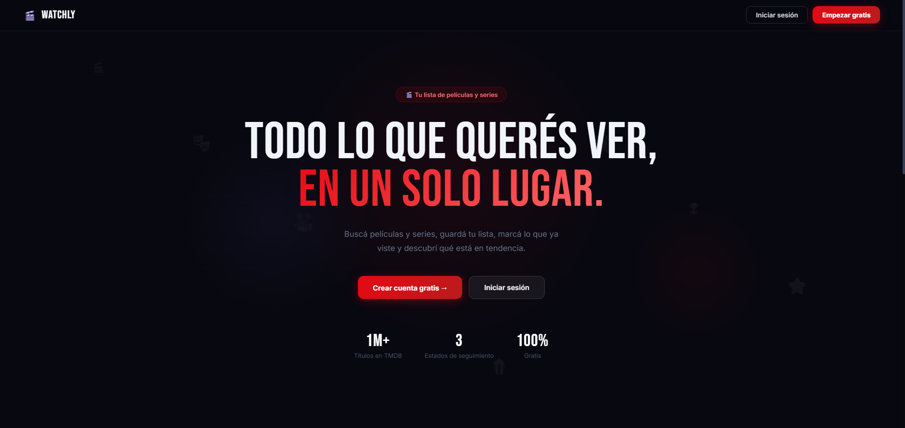
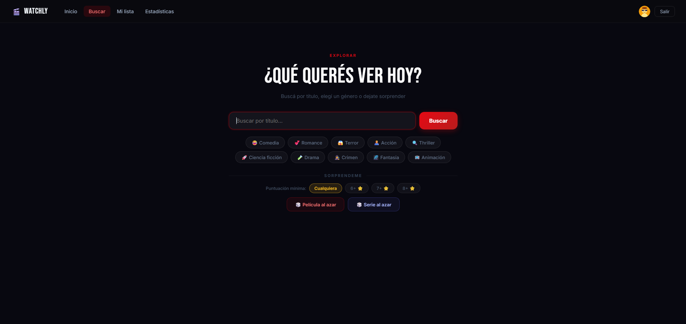
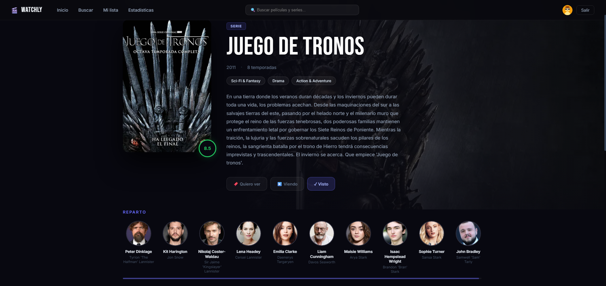
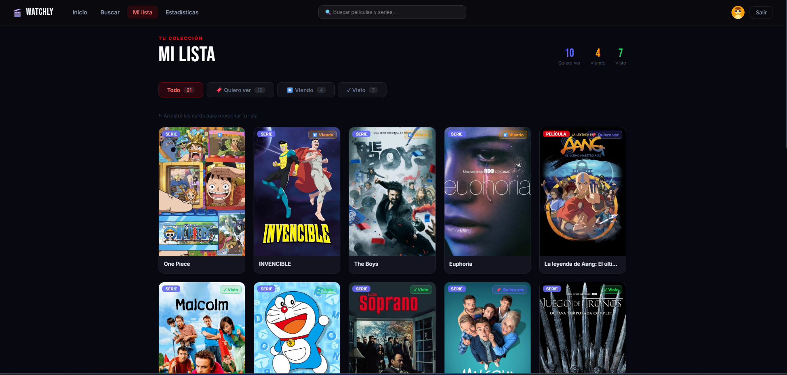
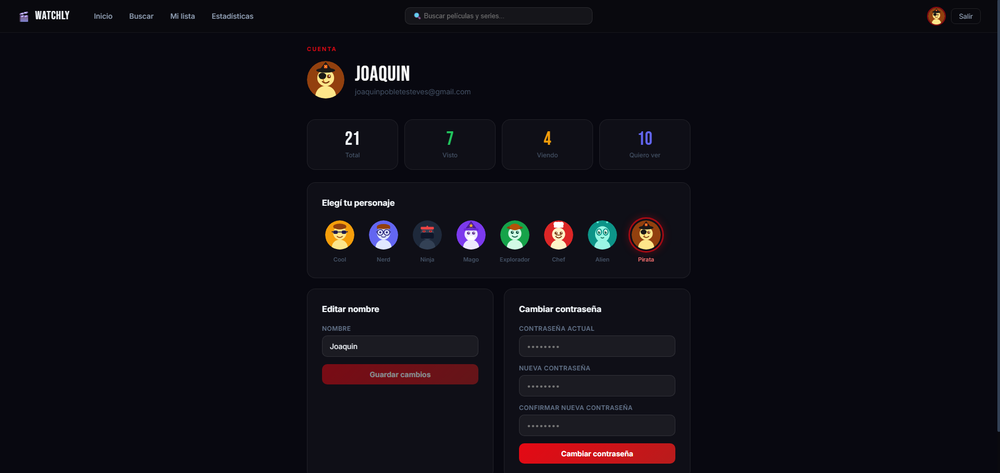
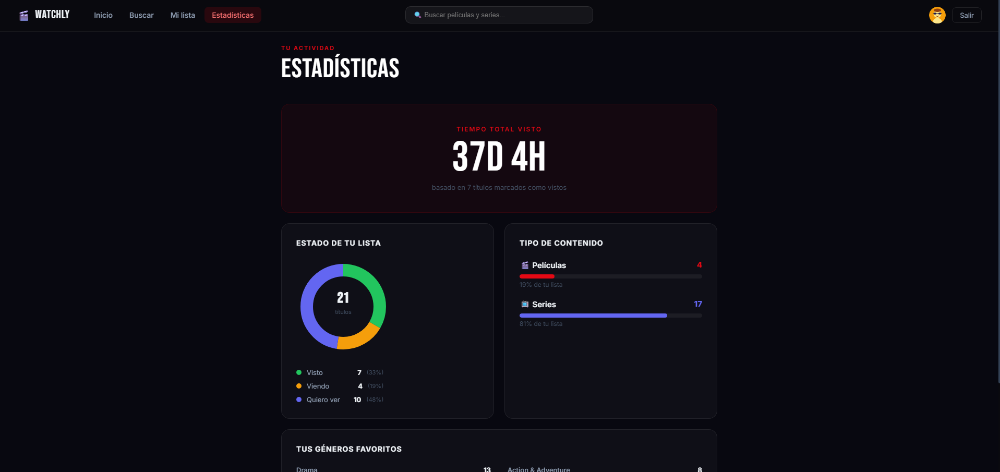

<div align="center">

# Watchly

**Tu lista personal de películas y series**

Buscá, guardá y organizá todo el contenido que querés ver — en un solo lugar.

[](https://nextjs.org/)
[](https://nodejs.org/)
[](https://www.postgresql.org/)
[](https://www.docker.com/)
[](https://www.themoviedb.org/)

[Ver demo en vivo](https://watchly-lime.vercel.app) · [Reportar un bug](https://github.com/joakol119/Watchly/issues)

</div>

---

## Screenshots









---

## Características

- **Autenticación** — Registro e inicio de sesión con JWT, confirmación de contraseña y validación en tiempo real
- **Tendencias** — Películas y series más populares de la semana con hero featured e infinite scroll
- **Búsqueda** — Por título, filtrado por géneros, película o serie al azar con puntuación mínima configurable
- **Detalle completo** — Sinopsis, reparto, calificación, trailer de YouTube, dónde ver (JustWatch) y títulos similares
- **Watchlist personal** — Guardá, actualizá el estado (Quiero ver / Viendo / Visto) y reorganizá con drag & drop
- **Listas personalizadas** — Creá colecciones con nombre y emoji para organizar tu contenido
- **Reseñas y calificaciones** — Escribí tu opinión y ponele tu nota del 1 al 10 a cada título
- **Recomendaciones** — Sugerencias personalizadas basadas en tus géneros más vistos
- **Estadísticas** — Tiempo total visto, géneros favoritos y distribución de contenido con gráficos
- **Perfil** — Elegí tu avatar, editá tu nombre y cambiá tu contraseña
- **Notificaciones** — Toast notifications en todas las acciones importantes

---

## Stack tecnológico

| Capa | Tecnología |
|------|-----------|
| Frontend | Next.js 14 (App Router), React 18 |
| Backend | Node.js, Express 5 |
| Base de datos | PostgreSQL 15 |
| Autenticación | JWT + bcryptjs |
| API externa | TMDB (The Movie Database) |
| Infraestructura | Docker Compose |
| Deploy | Vercel (frontend) + Railway (backend + DB) |

---

## Correr el proyecto localmente

### Requisitos previos

- [Docker Desktop](https://www.docker.com/products/docker-desktop/) instalado y corriendo
- Una API key de [TMDB](https://www.themoviedb.org/settings/api) (gratuita)

### Pasos

**1. Cloná el repositorio**

```bash
git clone https://github.com/joakol119/Watchly.git
cd Watchly
```

**2. Configurá las variables de entorno**

```bash
cp .env.example .env
```

Editá el `.env` con tus valores:

```env
POSTGRES_USER=watchly
POSTGRES_PASSWORD=tu_password_seguro
POSTGRES_DB=watchly
JWT_SECRET=una_clave_secreta_larga_y_aleatoria
TMDB_API_KEY=tu_api_key_de_tmdb
ALLOWED_ORIGINS=http://localhost:3000,http://localhost:3001
NEXT_PUBLIC_API_URL=http://localhost:4001
```

**3. Levantá los contenedores**

```bash
docker compose up --build
```

**4. Abrí la app**

| Servicio | URL |
|----------|-----|
| Frontend | http://localhost:3001 |
| Backend | http://localhost:4001 |
| Health check | http://localhost:4001/health |

---

## Estructura del proyecto

```
watchly/
├── docker-compose.yml
├── .env.example
├── screenshots/
├── backend/
│   ├── Dockerfile
│   ├── package.json
│   └── src/
│       ├── index.js
│       ├── db.js
│       ├── middleware/
│       │   └── auth.js
│       └── routes/
│           ├── auth.js
│           ├── watchlist.js
│           ├── tmdb.js
│           ├── profile.js
│           ├── stats.js
│           └── lists.js
└── frontend/
    ├── Dockerfile
    ├── package.json
    ├── lib/
    │   └── api.js
    ├── components/
    │   ├── Navbar.js
    │   ├── MediaCard.js
    │   ├── Avatar.js
    │   ├── StarRating.js
    │   └── Toast.js
    └── app/
        ├── page.js              ← Landing
        ├── home/
        ├── login/
        ├── search/
        ├── watchlist/
        ├── lists/
        │   └── [id]/
        ├── recommendations/
        ├── stats/
        ├── profile/
        ├── movie/[id]/
        └── tv/[id]/
```

---

## API Endpoints

### Auth
| Método | Ruta | Descripción |
|--------|------|-------------|
| POST | `/auth/register` | Crear cuenta |
| POST | `/auth/login` | Iniciar sesión |

### Watchlist *(requiere token)*
| Método | Ruta | Descripción |
|--------|------|-------------|
| GET | `/watchlist` | Obtener lista del usuario |
| POST | `/watchlist` | Agregar título |
| PATCH | `/watchlist/reorder` | Reordenar con drag & drop |
| PATCH | `/watchlist/:id` | Actualizar estado, calificación o reseña |
| DELETE | `/watchlist/:id` | Eliminar título |

### Listas *(requiere token)*
| Método | Ruta | Descripción |
|--------|------|-------------|
| GET | `/lists` | Obtener todas las listas |
| POST | `/lists` | Crear lista |
| GET | `/lists/:id` | Detalle de una lista |
| DELETE | `/lists/:id` | Eliminar lista |
| POST | `/lists/:id/items` | Agregar título a lista |
| DELETE | `/lists/:id/items/:itemId` | Quitar título de lista |

### TMDB *(requiere token)*
| Método | Ruta | Descripción |
|--------|------|-------------|
| GET | `/tmdb/trending` | Tendencias de la semana |
| GET | `/tmdb/search?q=` | Buscar títulos |
| GET | `/tmdb/random?type=` | Título al azar |
| GET | `/tmdb/movie/:id` | Detalle de película |
| GET | `/tmdb/tv/:id` | Detalle de serie |
| GET | `/tmdb/recommendations` | Recomendaciones personalizadas |

### Perfil *(requiere token)*
| Método | Ruta | Descripción |
|--------|------|-------------|
| GET | `/profile` | Obtener perfil |
| PATCH | `/profile/name` | Actualizar nombre |
| PATCH | `/profile/avatar` | Actualizar avatar |
| PATCH | `/profile/password` | Cambiar contraseña |

### Estadísticas *(requiere token)*
| Método | Ruta | Descripción |
|--------|------|-------------|
| GET | `/stats` | Estadísticas de la watchlist |

---

## Autor

**Joaquín Poblete**

[](https://github.com/joakol119)

---

<div align="center">

*Hecho con Next.js, Node.js y la API de TMDB*

</div>
